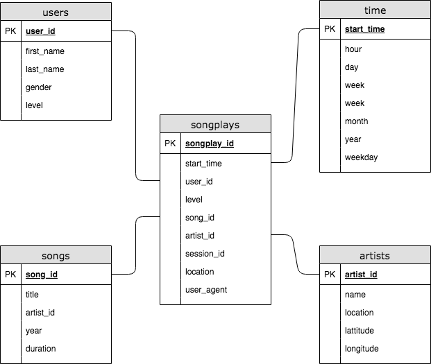

# Project: Data Modeling with PostgreSQL and ETL
A startup named Sparkify wants to analyze user activities using their song and user data. The current data is spread among several JSON files, making it hard to query and analyze.

This project aims to create an ETL pipeline to load song and user data to a Postgres database, making it easier to query and analyze data.

## A short description:
To complete the project, you will need to define fact and dimension tables for a star schema for a particular analytic focus, and write an ETL pipeline that transfers data from files in two local directories into the tables in Postgres using Python and SQL.

## Database Schema

- songplays: Records in log data associated with song plays
- users: Users in the app
- songs: Songs in music database
- artists: Artists in music database
- time: Timestamps of records in songplays broken down into specific units

## ETL Pipeline Details


### song_data ETL

#### Source dataset
Each file is in JSON format and contains metadata about a song and the artist of that song. The files are partitioned by the first three letters of each song's track ID. For example, here are filepaths to two files in this dataset.

`song_data/A/B/C/TRABCEI128F424C983.json
song_data/A/A/B/TRAABJL12903CDCF1A.json
`

And below is an example of what a single song file, TRAABJL12903CDCF1A.json, looks like.
```json
{
  "num_songs": 1,
  "artist_id": "ARJIE2Y1187B994AB7",
  "artist_latitude": null,
  "artist_longitude": null,
  "artist_location": "",
  "artist_name": "Line Renaud",
  "song_id": "SOUPIRU12A6D4FA1E1",
  "title": "Der Kleine Dompfaff",
  "duration": 152.92036,
  "year": 0
}
```

#### Final tabes
- songs table: Save song ID, title, artist ID, year, and duration from dataset

| song_id            | title                          | artist_id          | year | duration  |
|--------------------|--------------------------------|--------------------|------|-----------|
| SOFNOQK12AB01840FC | Kutt Free (DJ Volume Remix)    | ARNNKDK1187B98BBD5 | -    | 407.37914 |
| SOFFKZS12AB017F194 | A Higher Place (Album Version) | ARBEBBY1187B9B43DB | 1994 | 236.17261 |

- artist table: Save artist ID, name, location, latitude, and longitude from dataset

| artist_id          | name      | location        | lattitude | longitude |
|--------------------|-----------|-----------------|-----------|-----------|
| ARNNKDK1187B98BBD5 | Jinx      | Zagreb Croatia  | 45.80726  | 15.9676   |
| ARBEBBY1187B9B43DB | Tom Petty | Gainesville, FL | -         | -         |


### log_data ETL

#### Source dataset
The log files in the dataset you'll be working with are partitioned by year and month. For example, here are filepaths to two files in this dataset.

`log_data/2018/11/2018-11-12-events.json
log_data/2018/11/2018-11-13-events.json
`

And below is an example of what the data in a log file, 2018-11-12-events.json, looks like.
```json
{
  "artist": "Pavement",
  "auth": "Logged In",
  "firstName": "Sylvie",
  "gender": "F",
  "itemInSession": 0,
  "lastName": "Cruz",
  "length": 99.16036,
  "level": "free",
  "location": "Washington-Arlington-Alexandria, DC-VA-MD-WV",
  "method": "PUT",
  "page": "NextSong",
  "registration": 1540266185796.0,
  "sessionId": 345,
  "song": "Mercy:The Laundromat",
  "status": 200,
  "ts": 1541990258796,
  "userAgent": "\"Mozilla/5.0 (Macintosh; Intel Mac OS X 10_9_4) AppleWebKit/537.77.4 (KHTML, like Gecko) Version/7.0.5 Safari/537.77.4\"",
  "userId": "10"
}
```

#### Final tabes

- time table: Select ts from dataset and save extracted the timestamp, hour, day, week of year, month, year, and weekday from the ts field.

| start_time                 | hour | day | week | month | year | weekday |
|----------------------------|------|-----|------|-------|------|---------|
| 2018-11-29 00:00:57.796000 | 0    | 29  | 48   | 11    | 2018 | 3       |
| 2018-11-29 00:01:30.796000 | 0    | 29  | 48   | 11    | 2018 | 3       |


- users table: Save user ID, first name, last name, gender and level. If duplicated user information is delivered, Update level field.

| user_id | first_name | last_name | gender | level |
|---------|------------|-----------|--------|-------|
| 79      | James      | Martin    | M      | free  |
| 52      | Theodore   | Smith     | M      | free  |


- songplays table: Save the timestamp, user ID, level, song ID, artist ID, session ID, location, and user agent from dataset. The song ID and artist ID will be retrieved by querying the songs and artists tables to find matches based on song title, artist name, and song duration time.

| songplay_id | start_time                 | user_id | level | song_id | artist_id | session_id | location                            | user_agent                                                                                                              |
|-------------|----------------------------|---------|-------|---------|-----------|------------|-------------------------------------|-------------------------------------------------------------------------------------------------------------------------|
| 1           | 2018-11-29 00:00:57.796000 | 73      | paid  | -       | -         | 954        | Tampa-St. Petersburg-Clearwater, FL | "Mozilla/5.0 (Macintosh; Intel Mac OS X 10_9_4) AppleWebKit/537.78.2 (KHTML, like Gecko) Version/7.0.6 Safari/537.78.2" |
| 2           | 2018-11-29 00:01:30.796000 | 24      | paid  | -       | -         | 984        | Lake Havasu City-Kingman, AZ        | "Mozilla/5.0 (Windows NT 6.1; WOW64) AppleWebKit/537.36 (KHTML, like Gecko) Chrome/36.0.1985.125 Safari/537.36"         |
